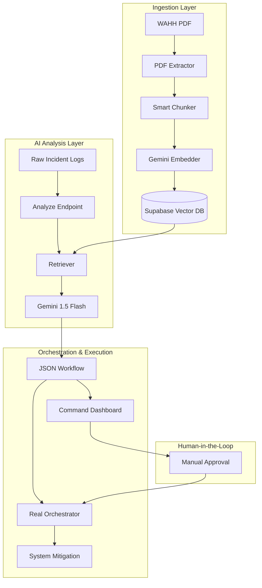

> **AI-Powered Incident Response: From Raw Logs to Automated Mitigation.**

[](https://fastapi.tiangolo.com/)
[](https://aistudio.google.com/)
[](https://supabase.com/)

---

## ⚙️ Technical Rationale

*   **AI Engine**: We utilize **Google Gemini 1.5 Flash** to leverage its generous **free tier** for high-performance embeddings and workflow generation, ensuring the project remains cost-effective for development and testing.
*   **Infrastructure**: Currently using Supabase Cloud for rapid prototyping. The system architecture is designed to support **self-hosted Supabase (Docker)** in later production phases for enhanced data sovereignty.

---

## 🧠 Project Summary

### The Problem
Cybersecurity teams are overwhelmed by thousands of alerts daily. Responding to these requires deep expertise, manual lookup of security handbooks (like WAHH), and complex coordination between different roles (CISO, Admin, SOC). This leads to **slow response times** and **human error**.

### The Solution
A **Retrieval-Augmented Generation (RAG)** orchestrator that ingests raw security logs (e.g., Wazuh, SIEM), analyzes them using expert knowledge from the *Web Application Hacker's Handbook*, and generates **Automated Incident Response Workflows**.

### The MVP
A dual-process pipeline that:
1.  **Diagnoses** the attack using a vector knowledge base.
2.  **Orchestrates** a multi-step JSON workflow.
3.  **Executes** "Easy Fix" security tasks automatically (e.g., IP blocking).

---

## 🏗️ System Architecture



---

## ✨ Key Features

### 1. Expert RAG Intelligence
The system doesn't just "guess." It searches over **736 specialized knowledge chunks** from the *Web Application Hacker's Handbook* to find the exact symptoms and mitigation steps for the detected attack.

### 2. Intelligent Task Assignment
Workflows aren't generic. The AI reads the `profiles` table to assign tasks to the right person based on:
*   **Role**: (e.g., CISO for strategic decisions, IT Admin for code fixes).
*   **Skills**: (e.g., "Python" or "Mitigation").
*   **Experience Level**: Junior vs. Senior tasks.

### 3. Real-World Orchestration
The included `orchestrator.py` can actually execute tasks:
*   **Automatic IP Blocking**: Generates real `pfctl`/`iptables` commands.
*   **Code Patching**: Simulates remediation script deployment.
*   **Webhook Sharing**: Automatically shares workflows with teammates via webhooks.

### 4. Command Dashboard
A premium, dark-mode interface for monitoring active attacks and manually approving high-risk AI actions.

---

## 🚀 Getting Started

### 1. Setup Environment
```bash
pip install -r requirements.txt
cp .env.example .env
# Fill in your GEMINI_API_KEY and SUPABASE credentials
```

### 2. Prepare Database
Run the SQL in `sql/schema.sql` in your Supabase SQL Editor.

### 3. Start the Engine
```bash
# Start the API
python3 -m uvicorn api:app --host 0.0.0.0 --port 8000

# Launch the Dashboard
python3 demo_server.py
```
👉 Open **http://localhost:8080/hackathon_demo.html** in your browser.

---

## 🛠️ Project Structure

| Component | Responsibility |
| :--- | :--- |
| `api.py` | Main FastAPI backend & Dual-Process IR Pipeline. |
| `orchestrator.py` | Real-world execution engine for security tasks. |
| `retriever.py` | RAG logic: Building expert context from Supabase. |
| `embedder.py` | Google Gemini 1.5 Flash / text-embedding-004 wrapper. |
| `hackathon_demo.html` | Premium Cyber-Command frontend dashboard. |
| `prompt_evolver.py` | System for benchmarking and improving AI accuracy. |

---

## 🎤 Pitch Deck Highlights

*   **Scalability**: Handles 19+ different attack types out of the box.
*   **Safety**: "Human-in-the-loop" approval for critical actions.
*   **Expertise**: Powered by the industry's "Security Bible" (WAHH).
*   **Efficiency**: Reduces response time from hours to seconds for common attacks.

---

### 🎨 Design & UX
The project follows a **"Glassmorphism / Dark Cyber"** aesthetic, emphasizing high-tech reliability and clear, actionable data visualization.

### 📈 Future Roadmap
- [ ] Direct integration with AWS/GCP Firewalls.
- [ ] Collaborative workflow editing for teams.
- [ ] Multi-PDF ingestion (OWASP Top 10, NIST).
